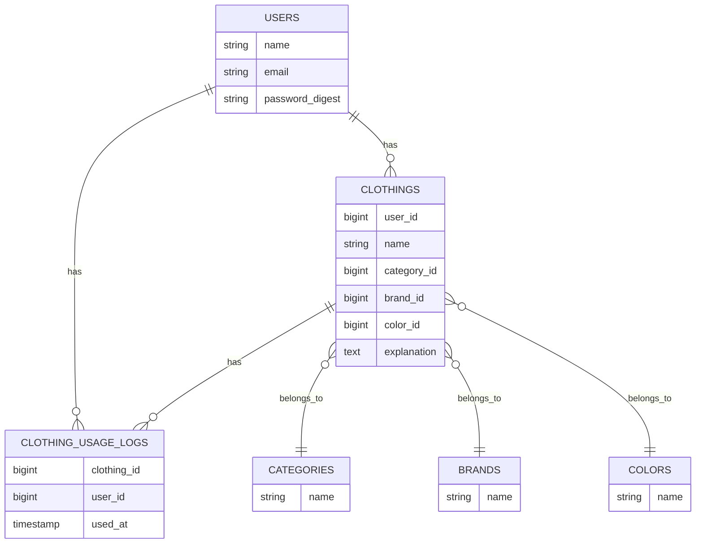

## Onkuro

『Onkuro』は、クローゼットの中身をオンラインで一元管理できるサービスです。 
服を登録することで持ち物の全体像が可視化され、「本当に必要な服」だけを残すための整理・見直し・手放す判断をサポートします。 
ミニマリストを目指している方や、クローゼットの中を整理したいと感じている方に向け、服を減らすことに特化したクローゼット管理ツールです。 

### リンク: https://onkuro.online/

## トップページ

## インフラ構成図

## ER図

## 使用技術スタック
- Ruby 3.3.5
- Ruby on Rails 8.0.1
- MySQL 9.1.0
- AWS (EC2 ELB RDS S3 Route53)
- JavaScript
- HTML/CSS

## 機能・画面
### ログイン機能
- メアドとパスワードでログイン可能、ホーム画面に遷移後に各機能を使用できます。

### ホーム(グラフ画面)
- 自分の所有している服のごと使用回数を円グラフで表示しています。 
ヘッダーから期間を指定するとその期間で使用された服の使用回数を表示できます。

### 一覧
- 登録した服の一覧から登録した服の名前で検索、使用回数での並び替え、ジャンルごとの並び替えが可能です。

### 登録
- 画像、名前、カテゴリ、色、ブランド、備考欄を入力し服を登録します。
- 画像は範囲部分にドラッグ&ドロップで画像を読み込み可能です。
- ブランド名はモーダルウィンドウを使用し文字入力による検索、絞り込みができます。

### 付近の古着屋、リサイクルショップを表示
- 自身の位置情報を取得し、周辺5kmの古着屋、リサイクルショップの取得をしいらない服の売り場に困りません (身バレ防止の為ランダムな位置情報を入れた画像です。)
- 赤ピンがホバーした際に店の詳細情報が表示されます

### アカウント管理
- ユーザ名、メールアドレスの更新
- パスワードの変更
- アカウント削除&ログアウトができます

## 技術的に工夫したところ
- ActiveStorage × S3連携による画像アップロード
- 服の使用時に、イベントを発生させイベント管理をしているテーブルに保存し使用回数をグラフで表示できるようにした
-  Google Maps APIを使用し現在地取得をできるようにした

## ユーザ目線で工夫したところ
- 服の管理だけでなく手放すことをサポートする為付近のリサイクルショップ、古着屋を簡単に探せるようにした
- 総使用回数だけでなく、指定した期間の使用回数を取得できるようにした
- ブランド名など項目が多くなる部分はモーダルウィンドウを作成し検索を簡単にした
- 余計な機能やボタンを増やさず、直感的に使用できるレイアウトを意識した

## テストユーザアカウント
- メールアドレス: test@example.com
- パスワード: password
